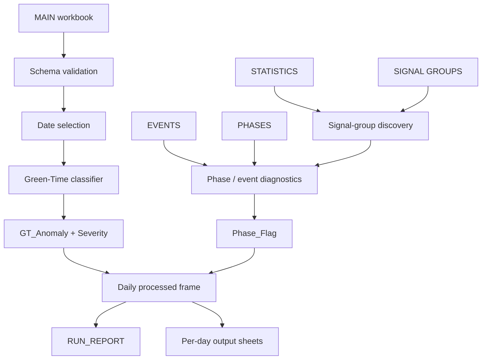

# NJDOT Green-Time Anomaly Detection

> Explainable Python-based ITS/SCATS operational validation workflow for Green-Time anomaly screening, batch processing, and traffic-signal data quality review.

[](https://perpsakach.github.io/)


## Overview

This project automates repetitive operational screening of traffic-signal Green-Time data. It compares observed MAIN Green Time against a dynamic mean-based baseline, keeps Green-Time anomalies separate from phase/signal-group diagnostics, supports multi-day batch processing, and generates structured review outputs.

The implementation is intentionally **explainable**. It is an operator-support and data-validation workflow, not an autonomous traffic-control system.

## Core anomaly rule

`GT_Anomaly` is derived from MAIN `Green Time (Sec)` compared with MAIN `GT_mean`:

```text
Anomaly if Green Time < 0.50 × GT_mean
        or Green Time > 1.50 × GT_mean
```

Severity tiers preserve later design work:

```text
Severe low:  Green Time < 0.35 × GT_mean
Severe high: Green Time > 2.00 × GT_mean
Approx. absolute short-GT guard: 5 seconds
```

A short Green Time is **not automatically a controller fault**. Demand, coordination, phase state, pedestrian operation, and time-of-day context can make short service legitimate.

## Architecture



## Important design distinction

`GT_Anomaly` and `Phase_Flag` answer different questions.

### `GT_Anomaly`

```text
MAIN Green Time (Sec) vs MAIN GT_mean
```

### `Phase_Flag`

```text
Yes if vehicle-demand mismatch OR signal-group inconsistency
```

The final Green-Time rule intentionally does **not** use `EVENTS Phase_GT` as its source.

## Recovered operational workflow

Historical exports were organized conceptually as:

```text
<site>.xlsx
EVENTS/N.xlsx
PHASES/N.xlsx
STATISTICS/STATN.xlsx
SIGNAL GROUPS/N SG<number>.xlsx
```

The batch runner supports date-oriented processing and produces a consolidated workbook containing a `RUN_REPORT` plus one sheet per selected day.

## Explainability example

```text
Observed Green Time = 31 s
GT_mean             = 80 s
0.50 threshold      = 40 s
GT ratio            = 0.3875
Classification      = Anomaly-Low
```

That output can be checked directly by an operator rather than relying on an opaque model score.

## Run

```bash
pip install -r requirements.txt
python run_pipeline.py --main path/to/site.xlsx --output outputs
```

## What this project demonstrates

- Python automation
- ITS / SCATS operational analytics
- explainable anomaly detection
- temporal and batch processing
- schema validation
- multi-export data handling
- operational governance and auditability
- separation of anomaly screening from root-cause diagnosis

## Safety / data handling

No live NJDOT/SCATS operational data, credentials, or sensitive production-site configuration are included in this repository.

The public code is a sanitized portfolio implementation intended to demonstrate methodology and engineering structure.

## Provenance

- **RECOVERED** — supported by prior project work and employment documentation
- **RECONSTRUCTED** — rebuilt where original source bytes were unavailable
- **ENHANCED** — portfolio-quality validation, tests, and structure
- **UNVERIFIED** — not presented as historical fact without evidence

See [`PROVENANCE.md`](PROVENANCE.md).

## Portfolio

Explore the complete technical portfolio at **[perpsakach.github.io](https://perpsakach.github.io/)**.