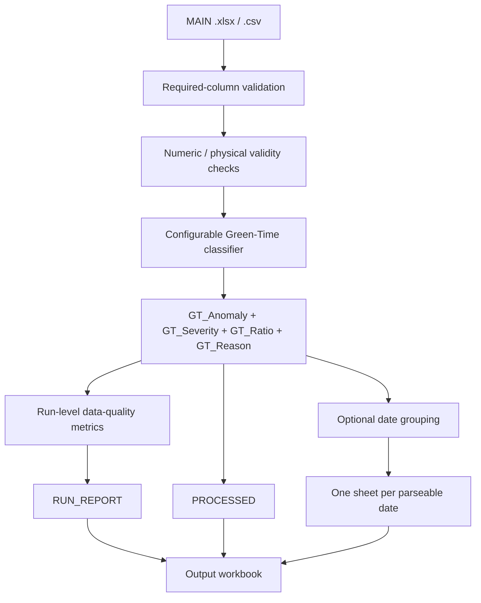

# NJDOT Green-Time Anomaly Detection

> Explainable Python-based ITS/SCATS operational screening workflow for Green-Time anomalies, batch workbook generation, and input data-quality review.

[](https://github.com/PerpsAkach/njdot-green-time-anomaly-detection/actions/workflows/ci.yml)
[](https://perpsakach.github.io/)


## Overview

This repository is a sanitized portfolio reconstruction of an operational traffic-signal validation workflow. The implemented pipeline reads a MAIN export from `.xlsx` or `.csv`, validates the required Green-Time fields, classifies each row against its row-level `GT_mean` baseline, records an explicit reason code, calculates run-level quality metrics, and writes an auditable Excel workbook.

The system is deliberately **explainable and non-autonomous**. It supports operator review; it does not control traffic signals, infer controller faults from a single short Green Time, or replace engineering judgment.

## Current implemented workflow



## Green-Time rule

For a valid row with observed Green Time `GT` and baseline `GT_mean`:

```text
Low anomaly:   GT < 0.50 × GT_mean
High anomaly:  GT > 1.50 × GT_mean
```

Default severity tiers are:

```text
Severe-Low:  GT <= 5 seconds OR GT < 0.35 × GT_mean
Anomaly-Low: GT < 0.50 × GT_mean
Normal:      0.50 × GT_mean <= GT <= 1.50 × GT_mean
Anomaly-High: GT > 1.50 × GT_mean
Severe-High:  GT > 2.00 × GT_mean
```

The exact 0.50 and 1.50 anomaly boundaries are treated as normal. The thresholds can be overridden from the CLI, and contradictory threshold configurations are rejected before processing.

## Explainability fields

Each processed row receives:

- `GT_Anomaly` — `Anomaly`, `No Anomaly`, or `Invalid`;
- `GT_Severity` — severity classification;
- `GT_Ratio` — `Green Time (Sec) / GT_mean`;
- `GT_Low_Threshold` and `GT_High_Threshold` — row-level comparison values;
- `GT_Reason` — deterministic reason code such as `low_ratio`, `high_ratio`, `non_numeric`, or `non_positive_baseline`.

Example:

```text
Observed Green Time = 31 s
GT_mean             = 80 s
Low threshold       = 40 s
GT ratio            = 0.3875
Classification      = Anomaly-Low
Reason              = low_ratio
```

## Data-quality review

`RUN_REPORT` summarizes both classification results and non-destructive input-quality indicators, including:

- total, valid, invalid, anomalous, and normal rows;
- counts by severity tier;
- anomaly rate over valid rows;
- missing Green Time values;
- missing `GT_mean` values;
- missing date/time values when those fields are present;
- duplicated complete date/time keys.

These are review indicators only. The pipeline does not impute missing operational values or reinterpret duplicates as controller faults.

## Daily batch output

If `DateConverted Hierarchy - Date` exists and contains parseable dates, the output workbook includes one additional sheet per date. Rows with an unparseable date remain in the complete `PROCESSED` sheet but are not silently assigned to a daily sheet.

The workbook always includes:

```text
RUN_REPORT
PROCESSED
[YYYY-MM-DD daily sheets when available]
```

## Phase / signal-group distinction

Recovered project context established an important conceptual distinction:

```text
GT_Anomaly  -> MAIN Green Time (Sec) compared with MAIN GT_mean
Phase_Flag  -> separate phase / signal-group diagnostic concept
```

The repository includes a small `evaluate_phase_flag()` primitive that preserves this separation. **The current public batch runner does not ingest EVENTS, PHASES, STATISTICS, or SIGNAL GROUPS exports and does not claim to reconstruct the original multi-export diagnostic logic.** That boundary is intentional because the underlying production artifacts and site configuration are not included publicly.

## Run the sanitized example

```bash
python -m pip install -r requirements.txt
python run_pipeline.py \
  --main sample_data/main_sanitized.csv \
  --output outputs
```

A timestamped Excel workbook will be written to `outputs/`.

Run with custom thresholds:

```bash
python run_pipeline.py \
  --main sample_data/main_sanitized.csv \
  --output outputs \
  --low 0.50 \
  --high 1.50 \
  --severe-low 0.35 \
  --severe-high 2.00 \
  --absolute-short 5
```

## Tests and CI

GitHub Actions validates the project on Python 3.11, 3.12, and 3.13. CI performs:

```text
Dependency installation
        ↓
Python source compilation
        ↓
Unit + integration tests
        ↓
Sanitized CLI end-to-end smoke run
        ↓
Workbook existence check
```

The automated tests cover classifier boundaries, severity tiers, invalid input reason codes, custom threshold validation, DataFrame enrichment, phase-flag separation, data-quality metrics, CSV/XLSX ingestion, daily grouping, run-report calculations, and workbook generation.

## Repository structure

```text
sample_data/
└── main_sanitized.csv       # fictional/sanitized demonstration input

src/
├── config.py                # validated threshold configuration and schema names
├── data_quality.py          # non-destructive MAIN quality metrics
├── gt_anomaly.py            # explainable row-level classifier
├── phase_flag.py            # separate phase-diagnostic primitive
└── pipeline.py              # ingestion, reporting, date grouping, workbook output

tests/
├── test_data_quality.py
├── test_gt_anomaly.py
├── test_phase_flag.py
└── test_pipeline.py

run_pipeline.py              # command-line entry point
```

## What this project demonstrates

- Python operational automation
- ITS / SCATS domain-aware analytics
- deterministic and explainable anomaly screening
- defensive schema and value validation
- configurable policy thresholds
- batch Excel reporting
- temporal grouping
- explicit data-quality metrics
- separation of anomaly screening from diagnostic/root-cause claims
- automated testing and multi-version CI
- public-data sanitization and provenance discipline

## Safety and operational boundary

No live NJDOT/SCATS operational data, credentials, production-site identifiers, or sensitive controller configuration are included.

A Green-Time anomaly is a **screening signal**, not a diagnosis. Demand, coordination, phase state, pedestrian service, timing-plan transitions, detector behavior, maintenance conditions, and other operational context may explain unusual Green Time. Any real operational decision requires authorized engineering review and the applicable agency procedures.

## Provenance

This repository uses explicit provenance labels:

- **RECOVERED** — supported by prior project/work artifacts or documented operational context;
- **RECONSTRUCTED** — rebuilt where literal historical source bytes were unavailable;
- **ENHANCED** — new portfolio-quality engineering, validation, testing, reporting, and CI;
- **UNVERIFIED** — not presented as historical fact without supporting evidence.

See [`PROVENANCE.md`](PROVENANCE.md) for the detailed boundary.

## Portfolio

Explore the complete technical portfolio at **[perpsakach.github.io](https://perpsakach.github.io/)**.
